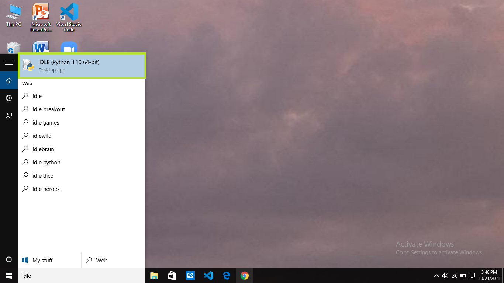
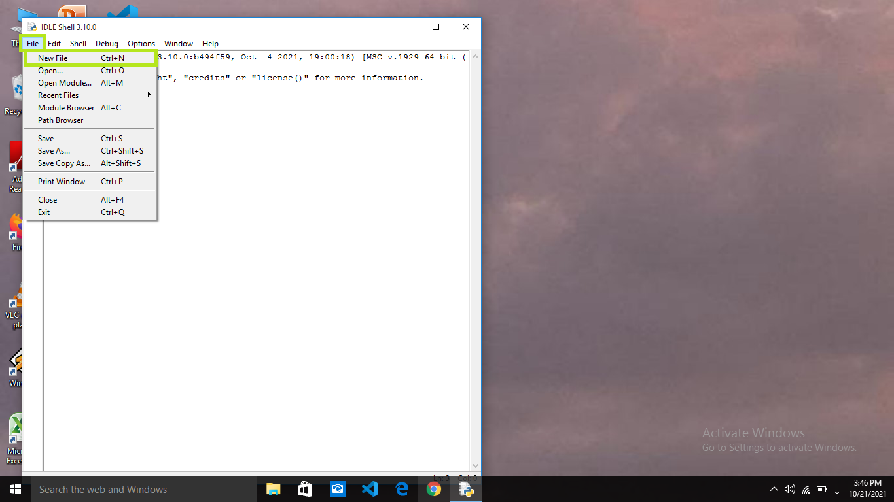
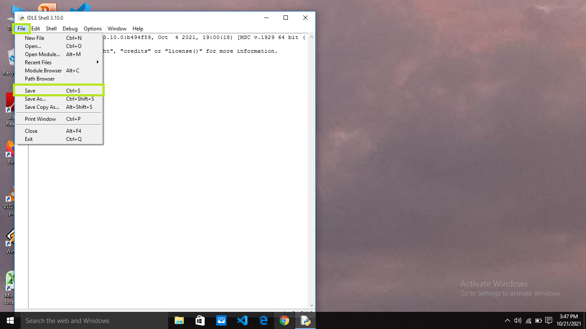
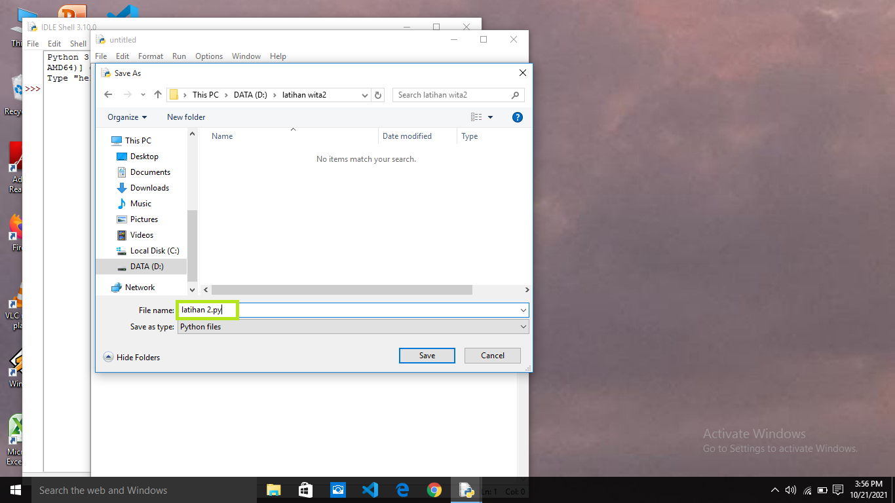
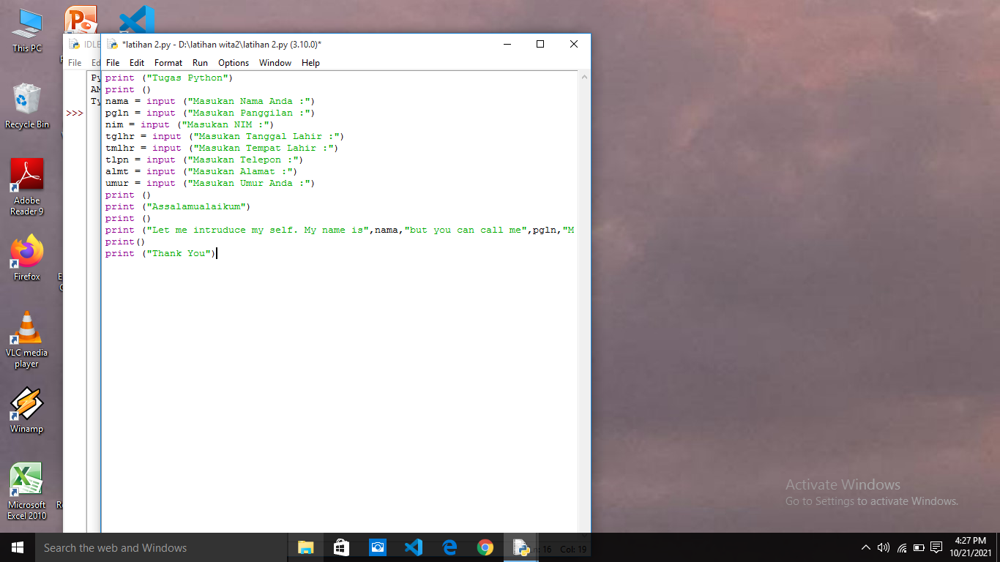
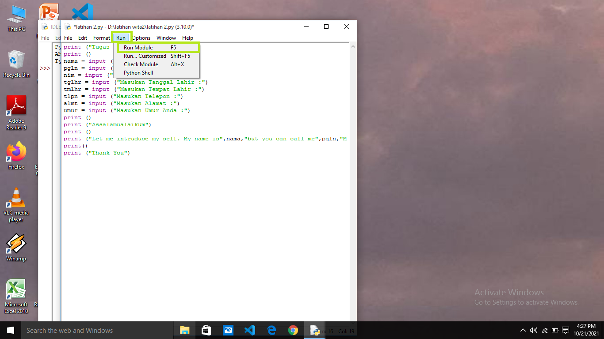
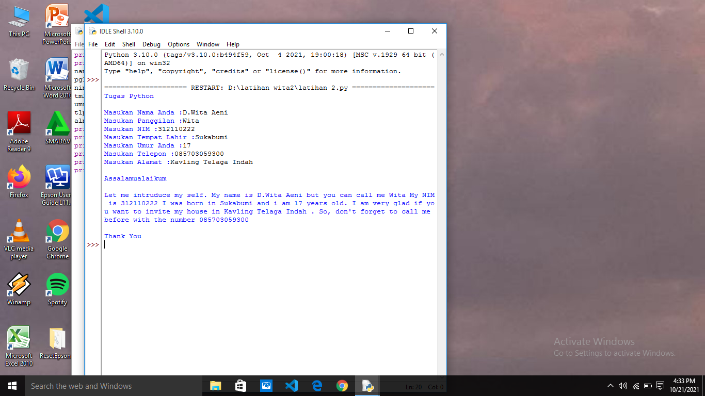

# Latihan2

# Cara Input Data Menggunakan Python
- Pertama buka IDLE Python di kolom pencarian

- Selanjutnya klik File, lalu klik New File atau bisa juga Ctrl+N

- Kemudian klik File, lalu klik Save atau bisa juga Ctrl+S

- Lalu untuk menyimpan File Python jangan lupa menggunakan format (.py)

- Lalu koding sesuai dengan yang kalian inginkan

- Kemudian klik Run, lalu klik Run Module bisa juga F5 untuk menjalankan program

- Hasilnya 

- Selesai

## Terima Kasih